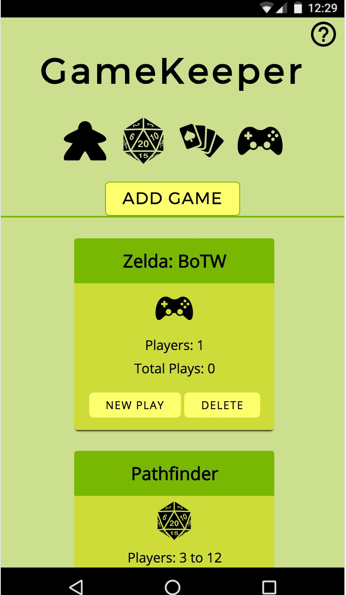

# GameKeeper

GameKeeper is a full stack application in which users can create a library of games and track each play session of those games.

## Background
I have always considered myself to be a gamer--not just in the contemporary sense but in regards to every medium available. I am originally from Las Vegas and grew up (and was briefly employed) in the casino industry. As such, card games and other games of chance have made their way into my family's game time. Being avid gamers, we're all quite competitive. Until now, we had no way of keeping track of all the different games we play. Every other app I have used limits the information tracking specifically to a single game medium. Now I'm able to jump across game media and keep track of every play session inside of one app!

## Use Case
This app is perfect for people that play a wide variety of games and want to begin collecting data about each play session that they partake in. 

## Screenshots

Mobile View:

Desktop View:

## Where Can I use it?
#### [_Live Example_](https://quiet-oasis-80361.herokuapp.com/#)

Or...you can clone the repository and really dive in!

## Technologies Used
#### _Front-End_
  * [HTML 5](https://developer.mozilla.org/en-US/docs/Web/Guide/HTML/HTML5)
  * [CSS3](https://developer.mozilla.org/en-US/docs/Web/CSS/CSS3)
  * [JavaScript](https://developer.mozilla.org/en-US/docs/Web/JavaScript) 
  * [jQuery](http://api.jquery.com/)
  * [Velocity.js](http://velocityjs.org/) - Transitions
  * [jQuery Modal](http://jquerymodal.com/) - Modals

#### _Back-End_
  * [Node.js](https://nodejs.org/en/docs/) & [Express.js](https://expressjs.com/) - Server Implementation
  * [MongoDB](https://www.mongodb.com/) & [Mongoose](http://mongoosejs.com/) - Database
#### _Testing_
  * [Mocha](https://mochajs.org/) & [Chai](http://chaijs.com/)

## Future Implementations

1. Connecting with different game APIs
   * Steam, GoG, Origin
   * Playstation Network
   * Xbox Live
   * Board Game Geek
   * Wizards of the Coast (Dungeons and Dragons)

2. A feature that gives you a filterable list of games based on the amount of time you have to play. 
   * For example, if you wanted to know which games in your library would be playable in less than 3 hours and still wanted a variety of at least 4 games, you would be able to find which ones at the click of a button.

3. Snazzier UX/UI - There is no such thing as a perfect app, right? 
   * Images for each game 
       * User added or pulled from an API
   * Swipe features - ideally, this app could funtion without text-inlayed buttons.

4. User Accounts & Authentication
   * Having a "parent" or admin account that can add users to view and update the game library.
   * Allowing other users to be tagged or added to a play session
   * Updating scores (if applicable) to each user.

5. Notations
   * Having the ability to notate play sessions would be extremely helpful in game analysis as well as table-top RPGs.

6. Saving Game State
   * Possibly take a picture of a current board game to later pick up at that point.
   * Allow users to save secret information
      * For example, if a user needs to save the cards in their hand for next time but doesn't want other players to know what they had.

## Graphic Attributions

[Game Icons](http://game-icons.net/) 
   * console-controller.svg
   * dice-twenty.svg
   * meeple.svg
   * poker-hand.svg

[Help Icon](https://www.flaticon.com/free-icon/help_565524) - Creative Commons
   * help.svg